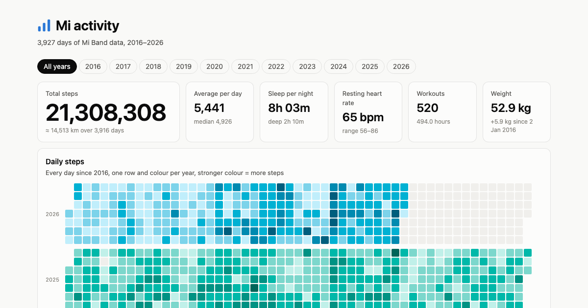

# Mi activity

Ten years of my Mi Band data — steps, sleep, heart rate, weight and workouts — on one page.

**Live:** https://sacret.github.io/activity/

[](https://sacret.github.io/activity/)

## What's on the page

- Summary tiles: total steps, daily average (with change vs the previous year), sleep, resting heart rate, workouts, weight
- Daily steps calendar, one row and colour per year
- Steps over time, by year/month and by weekday
- Sleep duration (total and deep) and sleep schedule (typical bedtime → wake-up)
- Resting heart rate and weight trends (the pregnancy period is marked on the weight chart)
- Workouts by type, personal records, and a table with all the numbers

Pick a year with the tabs at the top or the ← / → keys. Every view works in light and dark mode and on phones.

## How it's built

```
raw data/            exports from the bracelets' apps (not in git)
  └─ scripts/normalize.py   →  data/<year>/{daily,sleep,weight,workouts}.csv
      └─ scripts/build_page.py   →  index.html   (template: scripts/page.html)
          └─ scripts/make_og_image.py   →  og-image.png
scripts/make_icons.py   →  icons/
```

- **`scripts/normalize.py`** merges the exports into one format:
  - the old Mi Fit / Zepp per-year export (2016–2021)
  - the Mi Fitness export (2017–2026)
  - later Zepp scale exports with extra weigh-ins (2023–2026)

  Overlapping days prefer Mi Fitness. Times use the UTC offset you were actually in, so travel is included. Weigh-ins from other people on a shared scale are dropped, and nothing identifying ends up in `data/`. Columns are documented in [`data/README.md`](data/README.md).
- **`scripts/build_page.py`** reads `data/` and embeds it into a single `index.html`, with hand-written SVG charts and no libraries.
- **`scripts/make_og_image.py`** renders the social preview image with headless Google Chrome.

Only the Python standard library is needed, plus [Pillow](https://pypi.org/project/pillow/) for `make_icons.py` and Google Chrome for `make_og_image.py`.

## Updating

```sh
python3 scripts/normalize.py      # after putting a new export into "raw data/"
python3 scripts/build_page.py
python3 scripts/make_og_image.py
git commit -am "Update data" && git push   # GitHub Pages redeploys from master
```

## Notes on the data

- Heart rate starts in September 2018. Before that, the bands didn't measure it.
- Calories aren't shown: the older bands report active calories, while the current one reports a much larger figure.
- Deep-sleep estimates change between band generations.
- Nights shorter than 2 h or longer than 14 h (an unworn band scored as sleep) are left out of sleep figures.

## Credits

Made by [Anastasia Abakumova](https://sacret.ru/) and [Claude Code](https://claude.com/claude-code). The data belongs to Anastasia.
